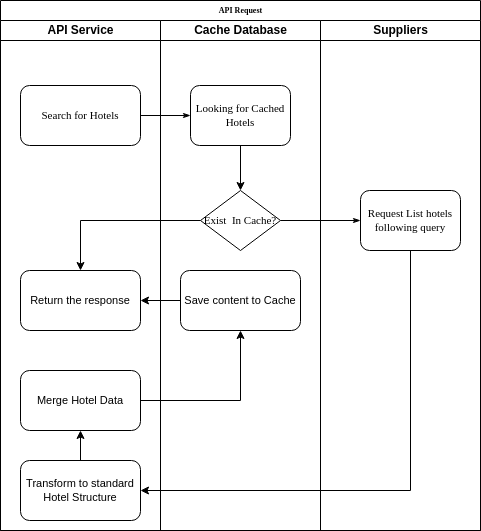

# Hotel data merger

## Introduce

> Application for transforming and cleansing hotel data from sources of data.

### Tech Stack

```
Language : Node 20.x & Typescript 5.3
Framework: NestJS
Database : TypeORM & sqlite
```

## How the process works

<figure>
    
    <figcaption>hotel data transform and merge dataflow</figcaption>
</figure>

### How the data was chosen?

#### Special fields

> `location`: {lat,lng} will be pick from whoever got most available data, else merge together. {address} will choose
> whoever get bigger length and others properties will pick either A or B if exist.
>
> `images`: Using a default object with structure {room, site,amenities} to keep RoomType seq, append and eliminate
> duplication by roomType via URL
>
> `amenities`: Using a default object with structure {general, room, site} to keep RoomType seq, append and eliminate
> duplication by roomType
>
> `booking_conditions`: Pick either A or B which array got bigger length.

#### The other fields

_Will pick via data type_

> `Number`: Pick either A or B.
>
> `String`: Pick the longer string. Logger means more detail.
>
> `Array`: Append together and eliminate the duplication.
>
> `Object`: Repeat the process recursively

## How To Install:

__Prerequisite:__
> Node version Node 20.x
>
> Package Manager: such as npm or yarn

1. Prepare .env file at web root folder.
    ```dotenv
    APPLICATION_NAME="Hotel Data Sanitizer"
    APP_VERSION="0.0.1"
    TZ=UTC
    APP_TIMEZONE=Asia/Singapore
    NODE_ENV=production
    ENV=production
    # Sqllite file path, Path will calculate from source root.
    DB_PATH='/var/database.sqlite'
    # API Request Timeout
    REQUEST_TIMEOUT=30000
    # CACHE: Accpecting 0 | 1
    CACHE_ENABLE=1
    #Lifetime in secs
    CACHE_LIFETIME=60
    ```
2. Install dependencies packages via package manager
    ```bash
    yarn install;
    ```

#### Run service in dev mode

```bash
yarn start:dev
```

Or

#### Run service with production built

```bash
yarn build && yarn start:prod
````

_After start successfully, Application will be available at [http://localhost:3000](http://localhost:3000)

## Testing

### Unit Test

```shell
yarn test
```

### E2E Testing

```
yarn test:e2e
```

## API

### Search Hotels

#### [POST] {base_url}/hotels/search

```http request
POST /hotels/search HTTP/1.1
Host: {baseUrl}
Content-Type: application/json
```

#### Payload

_Using with the following structure._
> `hotelIds`: Accepting array of Ids in string. Default: `[]`.
>
> `destinationIds`: Accept list of destination Ids. Default: `[]`.
>
> `page`, `pageSize`: Accept number for pagination. Default: `{page: 1, pageSize:10}`.

```json
{
  "hotelIds": [],
  "destinationIds": [],
  "page": 1,
  "pageSize": 5
}
```

### Response

```json
{
  "error": false,
  "result": {
    "searchResult": [
      {
        "id": "SjyX",
        "destination_id": 5432,
        "name": "InterContinental Singapore Robertson Quay",
        "location": {
          "city": "Singapore",
          "country": "SG",
          "address": "1 Nanson Rd, Singapore 238909"
        },
        "description": "InterContinental Singapore Robertson Quay is luxury's preferred address offering stylishly cosmopolitan riverside living for discerning travelers to Singapore. Prominently situated along the Singapore River, the 225-room inspiring luxury hotel is easily accessible to the Marina Bay Financial District, Central Business District, Orchard Road and Singapore Changi International Airport, all located a short drive away. The hotel features the latest in Club InterContinental design and service experience, and five dining options including Publico, an Italian landmark dining and entertainment destination by the waterfront.",
        "amenities": {
          "general": [
            "Pool",
            "WiFi ",
            "Aircon",
            "BusinessCenter",
            "BathTub",
            "Breakfast",
            "DryCleaning",
            "Bar",
            "outdoor pool",
            "business center",
            "childcare",
            "parking",
            "dry cleaning",
            "wifi",
            "concierge"
          ],
          "room": [
            "aircon",
            "minibar",
            "tv",
            "bathtub",
            "hair dryer"
          ]
        },
        "images": {
          "rooms": [
            {
              "link": "https://d2ey9sqrvkqdfs.cloudfront.net/Sjym/i93_m.jpg",
              "description": "Double room"
            },
            {
              "link": "https://d2ey9sqrvkqdfs.cloudfront.net/Sjym/i94_m.jpg",
              "description": "Bathroom"
            }
          ],
          "site": [
            {
              "link": "https://d2ey9sqrvkqdfs.cloudfront.net/Sjym/i1_m.jpg",
              "description": "Restaurant"
            },
            {
              "link": "https://d2ey9sqrvkqdfs.cloudfront.net/Sjym/i2_m.jpg",
              "description": "Hotel Exterior"
            },
            {
              "link": "https://d2ey9sqrvkqdfs.cloudfront.net/Sjym/i5_m.jpg",
              "description": "Entrance"
            },
            {
              "link": "https://d2ey9sqrvkqdfs.cloudfront.net/Sjym/i24_m.jpg",
              "description": "Bar"
            }
          ]
        },
        "booking_conditions": []
      },
      {
        "id": "f8c9",
        "destination_id": 1122,
        "name": "Hilton Tokyo Shinjuku",
        "location": {
          "city": "Tokyo",
          "country": "JP",
          "address": "160-0023, SHINJUKU-KU, 6-6-2 NISHI-SHINJUKU, JAPAN",
          "lat": 35.6926,
          "lng": 139.690965
        },
        "description": null,
        "amenities": {
          "general": [
            "Pool",
            "WiFi ",
            "BusinessCenter",
            "DryCleaning",
            " Breakfast",
            "Bar",
            "BathTub",
            "indoor pool",
            "business center",
            "wifi"
          ],
          "room": [
            "tv",
            "aircon",
            "minibar",
            "bathtub",
            "hair dryer"
          ],
          "site": []
        },
        "images": {
          "rooms": [
            {
              "link": "https://d2ey9sqrvkqdfs.cloudfront.net/YwAr/i1_m.jpg",
              "description": "Suite"
            },
            {
              "link": "https://d2ey9sqrvkqdfs.cloudfront.net/YwAr/i15_m.jpg",
              "description": "Double room"
            },
            {
              "link": "https://d2ey9sqrvkqdfs.cloudfront.net/YwAr/i10_m.jpg",
              "description": "Suite"
            },
            {
              "link": "https://d2ey9sqrvkqdfs.cloudfront.net/YwAr/i11_m.jpg",
              "description": "Suite - Living room"
            }
          ],
          "site": [
            {
              "link": "https://d2ey9sqrvkqdfs.cloudfront.net/YwAr/i55_m.jpg",
              "description": "Bar"
            }
          ],
          "amenities": [
            {
              "link": "https://d2ey9sqrvkqdfs.cloudfront.net/YwAr/i57_m.jpg",
              "description": "Bar"
            }
          ]
        },
        "booking_conditions": [
          "All children are welcome. One child under 6 years stays free of charge when using existing beds. There is no capacity for extra beds in the room.",
          "Pets are not allowed.",
          "Wired internet is available in the hotel rooms and charges are applicable. WiFi is available in the hotel rooms and charges are applicable.",
          "Private parking is possible on site (reservation is not needed) and costs JPY 1500 per day.",
          "When booking more than 9 rooms, different policies and additional supplements may apply.",
          "The hotel's free shuttle is offered from Bus Stop #21 in front of Keio Department Store at Shinjuku Station. It is available every 20-minutes from 08:20-21:40. The hotel's free shuttle is offered from the hotel to Shinjuku Train Station. It is available every 20-minutes from 08:12-21:52. For more details, please contact the hotel directly. At the Executive Lounge a smart casual dress code is strongly recommended. Attires mentioned below are strongly discouraged and may not permitted: - Night attire (slippers, Yukata robe, etc.) - Gym clothes/sportswear (Tank tops, shorts, etc.) - Beachwear (flip-flops, sandals, etc.) and visible tattoos. Please note that due to renovation works, the Executive Lounge will be closed from 03 January 2019 until late April 2019. During this period, guests may experience some noise or minor disturbances. Smoking preference is subject to availability and cannot be guaranteed."
        ]
      }
    ],
    "totalCollectionSize": 3
  }
}
```

**For more information: API docs page can be accessed by `http://{BASE_URL}/swagger`** 